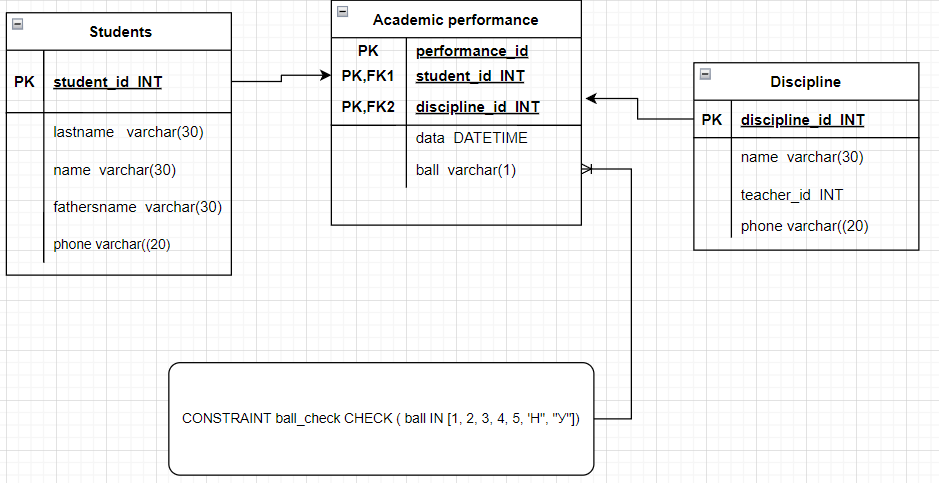
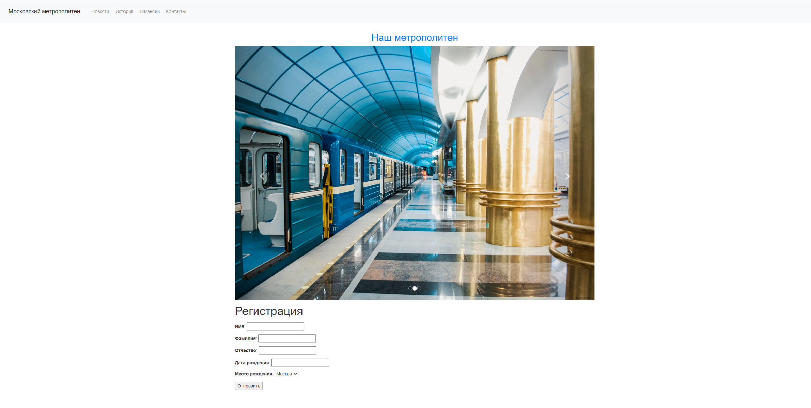

# ТЗ Московский метрополитен

## UML схема

##
`main.py` - запускает парсерс новостей сайта `roscosmos.ru` и пишет в БД `roskosmos_news.db`.

##
Файл `app/app.py` запускает локальный одностраничный сайт вебсайт с меню, каруселью и формой регитсрации.
